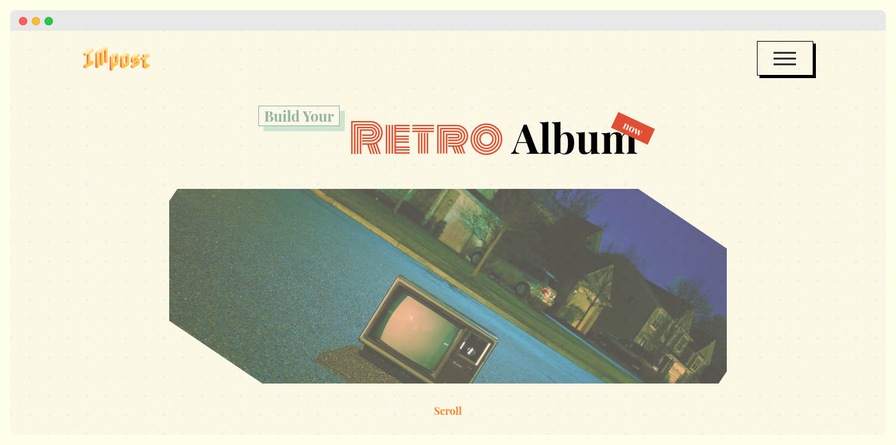
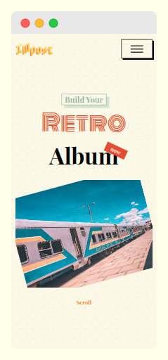

# IMpost - Retro

IMpost is a dummy website project using html-css-javascript. This app is intended for creating online collection for retro vibe image albums.  

  
### UI
<table>
    <tr>
        <td>
            
        </td>
        <td>
            
        </td>
    </tr>
</table>

### Resources
- Images: [unsplash.com](https://unsplash.com)
- Fonts: [Google Fonts](https://fonts.google.com)
- Color Palette: [colorhunt.co](https://colorhunt.co)